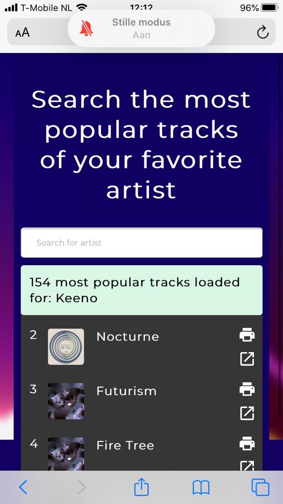

# Spotify Artists Best-Of Showcase
## Previews and live demo's

[Live Demo](https://meessour.github.io/web-app-from-scratch-1920/)

[[Outdated] Week 1 Demo](https://meessour.github.io/web-app-from-scratch-1920/code-archive-week-1/)

[[Outdated] Week 2 Demo](https://meessour.github.io/web-app-from-scratch-1920/code-archive-week-2/)

[[Outdated] Week 3 Demo](https://meessour.github.io/web-app-from-scratch-1920/code-archive-week-3/)
<details>
<summary>Week 1 preview</summary>


</details>

<details>
<summary>Week 2 preview</summary>


</details>

<details>
<summary>Week 3 preview</summary>


</details>

## Functionalities

The main functionality of the app is displaying the most popular tracks of an artists. [Spotify](https://www.spotify.com/) currently has this feature implemented, but with limitations. Spotify only showcases the top 10 most popular tracks of an artist on their page. This app also showcases the most popluar tracks, but without the limitation of 10 tracks.

## Actor diagram
<details>
<summary>Actor diagram (Week 2)</summary>


</details>

<details>
<summary>Actor diagram (Week 3)</summary>


</details>

## Interaction diagram 
<details>
<summary>Interaction diagram (Week 2)</summary>


</details>

<details>
<summary>Interaction diagram (Week 3)</summary>


</details>

## API
[The Spotify Web API](https://developer.spotify.com/documentation/web-api/) Based on simple REST principles, the Spotify Web API endpoints return JSON metadata about music artists, albums, and tracks, directly from the Spotify Data Catalogue.

There aren't any restrictions mentioned in the docs of REST Countries.

Here is the format in which the API returns it's data (fetching artists by search query in string format):
```json
{
  "artists" : {
    "href" : "",
    "items" : [ {
      "id" : "",
      "name" : "",
     ] },
  }
}
```

## Usage

Clone the project
```bash
git clone https://github.com/meessour/web-app-from-scratch-1920.git
```

Install the http-server package
```bash
npm i -g http-server
```

Run local server
```bash
hs
```

## Wishlist
- [ ] Filter for excluding/including (re)mixes, radio edits, live performances, extended versions, features, remastered versions, album versions, etc.

- [ ] Let the user choose how many tracks need to be shown
- [ ] Create playlist of all the tracks
- [ ] Replace the original generated playlist by the newly looked up artist
- [ ] Let the user choose between "create new playlist" and "replace old one"
- [ ] A better way of hiding the token

- [ ] Light weight web player that only works if musix plays on external device. Controllable by media keys

## Browser Technologies
Deze sectie gaat over toepassingen van Progressive enhancement. Er wordt getest via de Chrome browser via desktop

Ik ga deze web app testen op de volgende beperkingen:
- Afbeeldingen uitzetten
- Custom fonts uitzetten
- Kleur uitzetten & kleurenblindheid instellen
- Muis/Trackpad werkt niet
- Breedband internet uitzetten
- Javascript (volledig)
- Cookies niet accepteren
- localStorage doet het niet

#### Afbeeldingen uitzetten
Na het uitzetten van de afbeeldingen was de titel/omschrijving van de app niet te lezen. Dit komt omdat de achtergrond en text dezelfde kleur hebben
<details>
<summary>Zie voorbeeld</summary>


</details>

De tweede bevinding is dat de achtergrond van de zoekresultaten niet te zien is omdat het dezelfde kleur is als de achtergrond.

Ook wordt er een iccontje getoond op de locatie waar normaal de foto van de artiest te zien is. 

Daarnaast is de outlining van verschillende artiesten in de lijst niet gelijk.
<details>
<summary>Zie voorbeeld</summary>


</details>

Tot slot is er in de resultaten lijst een te grote afstand tussen de positienumering en tracknaam.
<details>
<summary>Zie voorbeeld</summary>


</details>

#### Font uitzetten
Na het uitzetten van de font functioneert de site nog exact hetzelfde. Door de automtische "fallback" font is de text moeilijker te lezen en past het niet bij de site.

<details>
<summary>Zie voorbeeld</summary>


</details>

#### Kleur uitzetten & kleurenblindheid instellen
Na het uitzetten van de kleuren is alles op de site nog goed te lezen. Wel is het moeilijk om de track resultaten sectie te onderscheiden van de achtergrond, ze hebben allebei een zwarte kleur nu. 

<details>
<summary>Zie voorbeeld</summary>


</details>

#### Muis/Trackpad werkt niet
Het is mogelijk om via TAB en/of SHIFT+TAB te navigeren tussen klikbare elementen op de site. Dit zijn: de zoekbalk, de zoekresultaten en open een track in spotify. Elementen zijn te selecteren door op ENTER te klikken.

#### Breedband internet uitzetten
Na het uitzetten van het internet wordt er autmoatisch een foutmedlign gegeven aan de gebruiker, alleen bevat deze geen tekstinhoud. Dit gebeurd zodra de gebruiker probeert te zoeken op een term of een zoekresultaat aan klikt.

<details>
<summary>Zie voorbeeld</summary>


</details>

#### Javascript (volledig)
Na het uitzetten van javascirpt worden er geen zoekresultaten en track resultaten weer gegeven. Er wordt ook geen feedback aan de gebruiker gegeven waardoor de grbuiker niet weet wat er aan de hand is. Het kan er voor zorgen dat de gebruiker denkt dat er nog wat geladen moet worden en kijkt vervolgens dan voor een lange periode naar het scherm, hopende dat er nog wat geladen zal worden.

<details>
<summary>Zie voorbeeld</summary>


</details>

#### Cookies niet accepteren
Na het uitzetten van de cookies worden er geen zoekresultaten en track resultaten weer gegeven. Er wordt een fout melding gegeven.

<details>
<summary>Zie voorbeeld</summary>


</details>

#### localStorage doet het niet
Na het uitzetten van de localStorage worden er geen zoekresultaten en track resultaten weer gegeven. Er wordt een fout melding gegeven.

<details>
<summary>Zie voorbeeld</summary>


</details>

## Tests op verschillende browsers

#### Microsoft edge (Desktop)
In microsoft edge werkte alles prima, alleen is er een visuele beperking bij het verkleinen van het scherm. De gebruiker is in staat om buiten de content (naar rechts) te scrollen. Het lijkt wel alsof er geen maxmimale width aanwezig is.

<details>
<summary>Zie voorbeeld</summary>


</details>

Daarnaast werd er een waarschuwing in the console getoond: 
```SEC7139: [CORS] The origin 'https://meessour.github.io' used the maximum Access-Control-Max-Age value of '604800' as the provided value exceeded this for a cross-origin request to 'https://api.spotify.com/v1/search?q=k&type=artist&limit=5'. ```

#### Firefox (Desktop)
Op Firefox (desktop) functioneerde alles naar wens

#### Safari (Mobile/iPad) & Chrome (iPad)
In Safari op een iPhone/iPad en Chrome op een iPad, waren er enkele visuele problemen. De titel van de site heeft een te grote afstand per letter. Voor een fractie van een seconde ziet de achtergrond er vreemd uit.

<details>
<summary>Zie voorbeeld iPhone Safari</summary>


</details>

<details>
<summary>Zie voorbeeld iPad Chrome</summary>


</details>

Daarnaast is de outlining van track items niet hetzelfde (Niet het geval op iPad (Chrome/Safari)).

<details>
<summary>Zie voorbeeld iPhone Safari</summary>


</details>

#### Firefox (Mobile)
In Firefox op een mobiel werkte alles naar wens. Er was alleen een ongewenste visuele eigenschap tijdens het indrukken van de zoekbalk. De zoekbalk werd dan heel erg transparant, waardoor de placeholder tekst niet meer goed te lezen was

<details>
<summary>Zie voorbeeld</summary>


</details>

#### Internet Explorer (Desktop)
In Internet Explorer werkte eigenlijk helemaal niks. Geen items werden ingeladen, er werd geen user feedback gegeven en de console gaf wat warnings en errors. Visueel zag alles er normaal uit.

<details>
<summary>Zie voorbeeld</summary>


</details>

## Screenreader
Voor het uitlezen van de inhoud van de site gebruikt ik (Pericles: Text to Speech Screen Reader): https://chrome.google.com/webstore/detail/pericles-text-to-speech-s/oacindbdmlbdeidohafnfocfckkhjlbg

De titel/omschrijving van de site werd opgelezen en all track resultaten. De zoek resultaten van de artiesten werden niet opgelezen.

<details>
<summary>Zie wat niet werd voorgelezen</summary>


</details>

## Licence
MIT © [Mees Sour](https://github.com/meessour)
